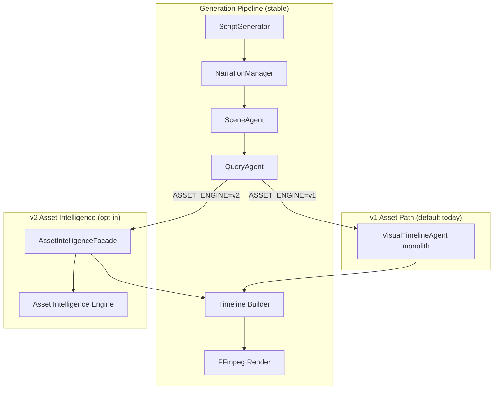
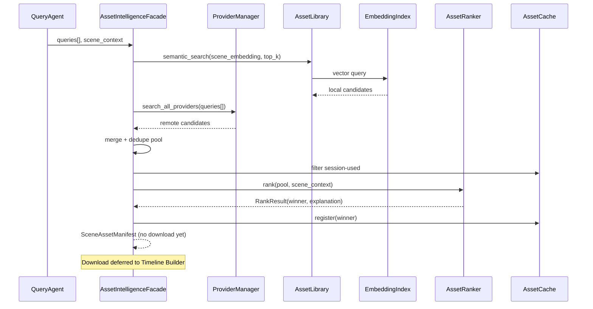
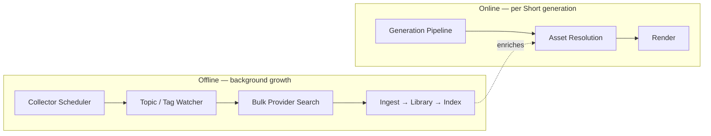
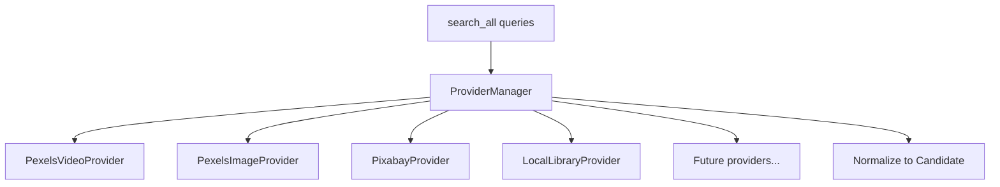

# AutoShorts v2 — Architecture Redesign

**Date:** 2026-07-06  
**Status:** Design proposal (no implementation)  
**Scope:** Long-term Asset Intelligence System layered on top of the existing generation pipeline  

---

## Executive Summary

AutoShorts today is a **linear pipeline** that generates a Short from a topic: script → narration → scenes → stock search → FFmpeg render. Asset handling is embedded inside `VisualTimelineAgent` (~1,250 lines), with resolution-based ranking and ephemeral caches.

**AutoShorts v2** introduces a dedicated **Asset Intelligence Engine** — a subsystem that can grow from “search Pexels per run” to “search hundreds of thousands of locally indexed assets with semantic retrieval,” without rewriting narration, scene planning, or rendering.

**Design principle:** *Strangler fig pattern.* The current pipeline keeps working unchanged. New intelligence layers sit behind stable interfaces and gradually absorb responsibilities from `VisualTimelineAgent`.

---

## Goals

| # | Goal | How |
|---|------|-----|
| 1 | Preserve all existing functionality | Stable I/O contracts (`scenes.json`, `audio/output.wav`, `videos/output.mp4`) |
| 2 | Keep current pipeline operational | v1 path remains default; v2 modules are opt-in behind feature flags |
| 3 | Independent Asset Intelligence growth | New `asset_intelligence/` package with clear module boundaries |
| 4 | Scale to 100k+ local assets | Persistent library, indexed metadata, embedding store, background collection |
| 5 | Avoid major rewrites | Facade + adapter pattern from existing agents to new engine |

---

## Current System (v1 Baseline)

### Pipeline today

```
Topic / Script
    │
    ▼
ScriptGenerator          (Ollama)
    │
    ▼
MetadataGenerator        (Ollama)
    │
    ▼
NarrationManager         (Piper / Kokoro)  →  audio/output.wav
    │
    ▼
CaptionGenerator         (script-timed / Whisper)  →  captions/output.srt
    │
    ▼
SceneAgent               (Ollama)  →  scenes/scenes.json
    │
    ▼
QueryAgent               (Ollama)  →  3–5 queries / scene
    │
    ▼
Multi-Query Search       (Pexels video pool + image fallback)
    │
    ▼
candidate_pool + SessionAssetRegistry  →  resolution rank + diversity
    │
    ▼
VisualTimelineAgent      (download + FFmpeg)  →  videos/output.mp4
```

### Current asset-related code map

| Component | Location | Role |
|-----------|----------|------|
| QueryAgent | `agents/query_agent.py` | Semantic search query generation |
| Candidate pool | `agents/candidate_pool.py` | Merge, dedupe, interim ranking |
| Session registry | `agents/session_asset_registry.py` | Per-run cross-scene dedup |
| Topic cache | `agents/topic_cache.py` | Topic-keyed asset reuse |
| Search cache | `agents/visual_asset_agent.py` | 24h API response cache |
| Pexels/Pixabay clients | `visual_timeline_agent.py`, `visual_asset_agent.py` | Remote provider search |
| VisualTimelineAgent | `agents/visual_timeline_agent.py` | Orchestration + render |

### Current limitations (motivation for v2)

- **No persistent asset library** — clips are downloaded per run and discarded conceptually after render.
- **No semantic ranking** — selection is resolution + portrait heuristics.
- **No embedding index** — cannot retrieve “visually similar” or “semantically relevant” clips offline.
- **Monolithic orchestration** — search, rank, cache, download, and FFmpeg live in one agent.
- **Single-provider bias** — Pexels video primary; Pixabay image fallback only.
- **Shared workspace** — API jobs use global paths (mitigated by single-job lock).

---

## Target System (v2 Vision)

### High-level pipeline

```
Topic
  │
  ▼
Script                    ← unchanged (ScriptGenerator)
  │
  ▼
Narrator                  ← unchanged (NarrationManager)
  │
  ▼
SceneAgent                ← unchanged
  │
  ▼
QueryAgent                ← unchanged (may later feed embedding queries)
  │
  ▼
┌─────────────────────────────────────────────────────────┐
│              ASSET INTELLIGENCE ENGINE                   │
│                                                          │
│  ┌──────────────┐   ┌──────────────┐   ┌────────────┐ │
│  │ Provider     │   │ Asset        │   │ Asset      │ │
│  │ Manager      │──▶│ Collector    │──▶│ Library    │ │
│  └──────────────┘   └──────────────┘   └─────┬──────┘ │
│         │                    │               │        │
│         ▼                    ▼               ▼        │
│  ┌──────────────┐   ┌──────────────┐   ┌────────────┐ │
│  │ Remote       │   │ Metadata     │   │ Embedding  │ │
│  │ Providers    │   │ Index        │   │ Index      │ │
│  │ Pexels etc.  │   └──────────────┘   └────────────┘ │
│  └──────────────┘            │               │        │
│                              └───────┬───────┘        │
│                                      ▼                │
│                              ┌──────────────┐           │
│                              │ Asset Ranker │           │
│                              └──────┬───────┘           │
│                                     │                   │
│                              ┌──────▼───────┐           │
│                              │ Asset Cache  │           │
│                              └──────────────┘           │
└─────────────────────────────────────────────────────────┘
  │
  ▼
Timeline Builder          ← slimmed VisualTimelineAgent (render only)
  │
  ▼
Render                    ← FFmpeg mux (unchanged contract)
```

### v1 vs v2 coexistence



During migration, `Timeline Builder` accepts a **resolved scene asset manifest** regardless of whether v1 or v2 produced it:

```json
{
  "scene_number": 1,
  "asset_uri": "asset://library/pexels/3847592.mp4",
  "local_path": "assets/timeline/scene_1.mp4",
  "clip_id": "3847592",
  "source": "pexels_video",
  "query": "rural farm fields",
  "rank_score": 0.87,
  "duration_seconds": 5.1
}
```

---

## Package Layout

```
asset_intelligence/
├── __init__.py
├── facade.py                    # Stable entry point for pipeline
├── models.py                    # AssetRecord, Candidate, SearchRequest, RankResult
│
├── asset_collector/             # Phase 3.1
│   ├── collector.py
│   ├── download_queue.py
│   └── ingestion_pipeline.py
│
├── asset_library/               # Phase 3.2
│   ├── library.py
│   ├── storage_layout.py
│   └── lifecycle.py
│
├── asset_index/                 # Phase 3.3
│   ├── metadata_index.py
│   ├── search_index.py
│   └── schema.py
│
├── asset_providers/             # Phase 3.6
│   ├── provider_manager.py
│   ├── base.py
│   ├── pexels_video.py
│   ├── pexels_image.py
│   ├── pixabay.py
│   └── local_library.py
│
├── asset_ranker/                # Phase 2.4 → 3.7
│   ├── ranker.py
│   ├── resolution_scorer.py
│   ├── semantic_scorer.py
│   └── diversity_scorer.py
│
├── asset_cache/                 # Evolve from SearchCache + topic cache
│   ├── search_cache.py
│   ├── session_registry.py
│   └── topic_cache.py
│
├── asset_metadata/              # Phase 3.3
│   ├── extractor.py
│   ├── normalizer.py
│   └── schema.py
│
└── asset_embeddings/            # Phase 3.4–3.5
    ├── embedder.py
    ├── vector_store.py
    └── semantic_retriever.py
```

**Existing repo structure (unchanged during early phases):**

```
agents/                  # Scene, Query, Timeline agents (thin over time)
backend/                 # API, jobs, narration
script_generator.py      # Root-level generators (stable)
pipeline_runner.py
main.py
```

---

## Module Specifications

### `asset_intelligence/` (root)

| | |
|---|---|
| **Purpose** | Top-level package boundary; exposes stable API to the generation pipeline |
| **Responsibilities** | Feature flags, version selection (v1 adapter vs v2 engine), shared models |
| **Dependencies** | All submodules; `agents/query_agent` (query input only) |
| **Future roadmap** | Plugin registry for third-party asset sources; metrics/telemetry hooks |

**Key facade method (conceptual):**

```python
resolve_scene_assets(request: SceneAssetRequest) -> SceneAssetManifest
```

---

### `asset_collector/`

| | |
|---|---|
| **Purpose** | Acquire remote assets and ingest them into the local library |
| **Responsibilities** | Download queue, retry, checksum verification, dedup on ingest, provider attribution, rate-limit compliance |
| **Dependencies** | `asset_providers/`, `asset_library/`, `asset_metadata/` |
| **Future roadmap** | Background cron jobs, bulk collection by topic/tag, user-upload ingestion, YouTube-safe license tracking |

**Replaces over time:** ad-hoc download logic in `VisualTimelineAgent._download_scene_asset()`

---

### `asset_library/`

| | |
|---|---|
| **Purpose** | Persistent on-disk store for all acquired media |
| **Responsibilities** | Content-addressed storage (`sha256` prefix dirs), symlinks/hardlinks for scene references, quota management, garbage collection of unreferenced assets |
| **Dependencies** | Filesystem; `asset_metadata/` for sidecar records |
| **Future roadmap** | Tiered storage (hot SSD / cold HDD), S3-compatible backend, 100k+ asset scaling |

**Proposed layout:**

```
assets/library/
├── objects/
│   └── ab/cd/abcd1234....mp4      # content-addressed blobs
├── records/
│   └── {asset_id}.json            # metadata sidecar
└── manifest.db                    # SQLite catalog (Phase 3.2)
```

---

### `asset_index/`

| | |
|---|---|
| **Purpose** | Fast lookup structures over library metadata |
| **Responsibilities** | SQLite/FTS5 keyword index, facet filters (provider, orientation, duration, tags), pagination, incremental rebuild |
| **Dependencies** | `asset_library/`, `asset_metadata/` |
| **Future roadmap** | Hybrid search (keyword + vector), multi-field ranking pre-filter |

---

### `asset_providers/`

| | |
|---|---|
| **Purpose** | Unified interface to remote and local asset sources |
| **Responsibilities** | Provider registration, search normalization, per-provider rate limits, credential management, result → `Candidate` mapping |
| **Dependencies** | HTTP clients; `asset_cache/search_cache` |
| **Future roadmap** | Unsplash, Storyblocks, Coverr, custom CDN, user NAS folder provider |

**Provider interface (conceptual):**

```python
class AssetProvider(ABC):
    name: str
    def search(self, query: str, *, limit: int, filters: SearchFilters) -> list[Candidate]: ...
    def fetch_metadata(self, clip_id: str) -> AssetMetadata: ...
```

**Migrates from:** `PexelsVideoClient`, `PexelsClient`, `PixabayClient` in `visual_timeline_agent.py` / `visual_asset_agent.py`

---

### `asset_ranker/`

| | |
|---|---|
| **Purpose** | Score and rank candidate pools per scene |
| **Responsibilities** | Multi-signal ranking (resolution, semantic similarity, duration fit, diversity), explainable scores, fallback policies |
| **Dependencies** | `asset_embeddings/` (when available), `asset_cache/session_registry`, scene context from `SceneRecord` |
| **Future roadmap** | Learned ranker, A/B scoring models, user feedback loop |

**Absorbs:** `agents/candidate_pool.select_best_candidate()`, `VideoCandidate.score()`

**Ranking signals (evolution):**

| Phase | Signals |
|-------|---------|
| Today (v1) | Resolution, portrait, duration |
| 2.4 | + query-scene embedding similarity |
| 3.7 | + quality score (sharpness, motion, aesthetic model) |
| 3.8 | + library freshness, usage frequency, topic affinity |

---

### `asset_cache/`

| | |
|---|---|
| **Purpose** | All caching layers unified under one policy system |
| **Responsibilities** | API search cache (24h), session dedup registry, topic-level reuse, optional CDN edge cache |
| **Dependencies** | Filesystem |
| **Future roadmap** | Redis for multi-worker API, cache warming from collector |

**Migrates from:**

- `agents/visual_asset_agent.SearchCache`
- `agents/session_asset_registry.SessionAssetRegistry`
- `agents/topic_cache.TopicAssetCache`

---

### `asset_metadata/`

| | |
|---|---|
| **Purpose** | Normalize and enrich asset descriptive data |
| **Responsibilities** | Extract provider fields, ffprobe technical metadata, auto-tags, license fields, orientation/duration normalization |
| **Dependencies** | `asset_library/` (on ingest), ffprobe |
| **Future roadmap** | Vision model auto-captioning, shot-boundary detection, dominant color extraction |

**Canonical record (conceptual):**

```json
{
  "asset_id": "pexels:3847592",
  "provider": "pexels",
  "clip_id": "3847592",
  "download_url": "https://...",
  "content_hash": "sha256:abcd...",
  "local_path": "assets/library/objects/ab/cd/abcd....mp4",
  "width": 1080,
  "height": 1920,
  "duration_seconds": 12.4,
  "orientation": "portrait",
  "tags": ["farm", "tractor", "rural"],
  "license": "pexels",
  "photographer": "...",
  "indexed_at": "2026-07-06T00:00:00Z",
  "embedding_id": "emb_12345"
}
```

---

### `asset_embeddings/`

| | |
|---|---|
| **Purpose** | Vector representations for semantic search and ranking |
| **Responsibilities** | Embed scene descriptions and asset thumbnails/keyframes, store vectors, k-NN retrieval, embedding versioning |
| **Dependencies** | `asset_library/`, `asset_metadata/`; local model (e.g. CLIP, nomic-embed) or Ollama embeddings |
| **Future roadmap** | Multi-modal search (text → video), temporal segment embeddings, re-index on model upgrade |

**Storage options (scale path):**

| Scale | Store |
|-------|-------|
| < 10k assets | SQLite + numpy blobs |
| 10k–100k | LanceDB / Chroma (local) |
| 100k+ | Qdrant or pgvector |

---

## Asset Intelligence Engine — Runtime Flow

### Per-scene resolution (v2)



### Collection vs generation (decoupled)



Generation **reads** from the library; collection **writes** to it. This separation is what enables scaling to hundreds of thousands of assets without slowing each render.

---

## Stable Contracts (must not break)

These paths and formats remain the **public contract** for CLI, API, and frontend:

| Contract | Producer | Consumer |
|----------|----------|----------|
| `scripts/script.txt` | ScriptGenerator | Narration, Captions, SceneAgent |
| `audio/output.wav` | NarrationManager | SceneAgent, Captions, Timeline |
| `captions/output.srt` | CaptionGenerator | Timeline Builder |
| `scenes/scenes.json` | SceneAgent | Asset Intelligence input |
| `videos/output.mp4` | Timeline Builder | API / user |
| `jobs/{id}/output.mp4` | JobManager | Frontend |

**Internal contract (new, v2):**

| Contract | Producer | Consumer |
|----------|----------|----------|
| `SceneAssetRequest` | VisualTimelineAgent / Facade | Asset Intelligence Engine |
| `SceneAssetManifest[]` | Asset Intelligence Engine | Timeline Builder |
| `assets/library/` | Asset Collector | Asset Library, Index, Ranker |

---

## Module Disposition Matrix

### Remain untouched (stable)

| Module | Reason |
|--------|--------|
| `script_generator.py` | Clean boundary; no asset concerns |
| `metadata_generator.py` | Metadata for YouTube publish only |
| `backend/services/narration/` | Phase 1.2 abstraction complete; `audio/output.wav` contract |
| `voice_generator.py` | Thin facade over narration |
| `caption_generator.py` | Audio/script contract independent of visuals |
| `agents/scene_agent.py` | Scene planning stable; output schema unchanged |
| `agents/query_agent.py` | Query generation stable; becomes input to engine |
| `agents/subtitle_config.py` | Render concern only |
| `backend/api.py` | Thin HTTP layer; no asset logic |
| `backend/job_manager.py` | Job lifecycle; artifact copy unchanged |
| `pipeline_timing.py` | Perf labels; may add new phases only |
| `frontend/` | Consumes same API contracts |

### Extend (adapter / thin wrapper)

| Module | Extension |
|--------|-----------|
| `agents/visual_timeline_agent.py` | Split into **Timeline Builder** (render) + delegate asset resolution to `AssetIntelligenceFacade`; shrink over phases |
| `agents/candidate_pool.py` | Move into `asset_ranker/`; keep import shim during migration |
| `agents/session_asset_registry.py` | Move into `asset_cache/`; same JSON path initially |
| `agents/topic_cache.py` | Move into `asset_cache/`; later backed by library records |
| `backend/pipeline_runner.py` | Optional `ASSET_ENGINE` env flag; per-job workspace (future) |
| `main.py` | Same feature flag passthrough |
| `pipeline_timing.py` | Add `PHASE_ASSET_INTELLIGENCE` sub-phases |

### Eventually deprecate

| Module | Replacement | Timeline |
|--------|-------------|----------|
| `agents/visual_asset_agent.py` → `VisualAssetAgent` class | `asset_providers/` + `asset_collector/` | Phase 3.6 |
| `agents/visual_asset_agent.py` → `keywords_from_description()` | QueryAgent only (already primary) | Remove when QueryAgent fallback moved |
| `PexelsVideoClient` inside `visual_timeline_agent.py` | `asset_providers/pexels_video.py` | Phase 3.6 |
| `video_generator.py` | Already unused; delete when confirmed | Anytime |
| `agents/timeline_video_builder.py` (legacy image path) | Timeline Builder motion module | After v2 stable |
| Inline download in `VisualTimelineAgent` | `asset_collector/download_queue.py` | Phase 3.1 |
| Resolution-only `VideoCandidate.score()` | `asset_ranker/` multi-signal | Phase 2.4 / 3.7 |

**Not deprecated:** `VisualTimelineAgent` name may persist as the **Timeline Builder** facade even after slimming.

---

## Future Phases

### Phase 2.x — Intelligence on current architecture (near term)

| Phase | Name | Scope | Touches |
|-------|------|-------|---------|
| **2.4** | Semantic Clip Ranking | Embed scene + candidates; relevance score in ranker | `candidate_pool` → `asset_ranker` precursor |
| **2.5** | Timeline Builder extraction | Split render from search in `VisualTimelineAgent` | `visual_timeline_agent.py` |

### Phase 3.x — Asset Intelligence Engine (long term)

| Phase | Name | Deliverable | Outcome |
|-------|------|-------------|---------|
| **3.1** | Asset Collector | `asset_collector/` — download queue, ingest pipeline, checksums | Assets persist beyond single run |
| **3.2** | Asset Library | `asset_library/` — content-addressed store + SQLite catalog | Durable local media corpus |
| **3.3** | Metadata Index | `asset_metadata/` + `asset_index/` — FTS, facets, ffprobe enrichment | Sub-second metadata search at 100k scale |
| **3.4** | Embedding Index | `asset_embeddings/` — CLIP/Ollama vectors, LanceDB/Chroma | Semantic representation of every asset |
| **3.5** | Semantic Retrieval | Text/scene → vector search over library + provider merge | "Find clips like this description" offline |
| **3.6** | Provider Manager | `asset_providers/` — unified provider interface, extract Pexels/Pixabay | Add providers without touching pipeline |
| **3.7** | Asset Quality Scoring | Aesthetic/sharpness/motion signals in ranker | Better than resolution-only |
| **3.8** | Automatic Asset Growth | Background collector by topic trends, script keywords, gap detection | Library grows without manual curation |

### Phase 4.x — Platform (optional future)

| Phase | Name | Scope |
|-------|------|-------|
| 4.1 | Per-job workspace isolation | `jobs/{id}/workspace/` eliminates global path clashes |
| 4.2 | Multi-worker pipeline | Redis queue + distributed asset cache |
| 4.3 | Asset admin UI | Browse library, tag, ban, favorite clips |
| 4.4 | Feedback loop | User thumbs-up/down → ranker training data |

---

## Phase 3.1 — Asset Collector (detail)

**Goal:** Any clip selected or discovered gets ingested into the library automatically.

```
Provider search result
        │
        ▼
DownloadQueue.enqueue(url, metadata)
        │
        ▼
Verify (size, magic bytes, ffprobe)
        │
        ▼
Content-hash dedup → skip if exists
        │
        ▼
Write assets/library/objects/{hash}.mp4
        │
        ▼
Write assets/library/records/{asset_id}.json
        │
        ▼
Notify asset_index (incremental)
```

**Preserves v1 behavior:** Generation still downloads to `assets/timeline/scene_N.mp4` for FFmpeg; collector **also** copies into library (dual-write during migration).

---

## Phase 3.2 — Asset Library (detail)

**Goal:** Single source of truth for "what assets do we own?"

- **Catalog DB:** SQLite with tables `assets`, `tags`, `providers`, `usages`
- **Usage tracking:** which Short used which asset (`short_id`, `scene_number`, `selected_at`)
- **Dedup key:** `(provider, clip_id)` + `content_hash`
- **GC:** remove unreferenced blobs only when no usage records and older than retention policy

**Scale target:** 100k assets ≈ 500GB–2TB video; index DB stays < 500MB.

---

## Phase 3.3 — Metadata Index (detail)

**Indexed fields:**

| Field | Source | Searchable |
|-------|--------|------------|
| title, tags, description | Provider API | FTS |
| width, height, duration | ffprobe | Range filter |
| orientation | computed | Facet |
| provider, license | provider | Facet |
| content_hash | collector | Exact |
| usage_count | library | Sort key |

---

## Phase 3.4 — Embedding Index (detail)

**Embedding targets:**

1. **Text:** provider description + auto-tags + scene query
2. **Visual:** keyframe at 25% duration (CLIP image encoder)

**Re-index strategy:** Store `embedding_model_version`; background re-embed when model upgrades.

---

## Phase 3.5 — Semantic Retrieval (detail)

**Retrieval order (hybrid):**

```
1. Local library vector search     (top 20)
2. Provider multi-query search   (top 30)
3. Merge + dedupe
4. Metadata pre-filter           (orientation, duration, min resolution)
5. Ranker                        (semantic + quality + diversity)
```

Local results preferred when score within threshold (faster, no API cost).

---

## Phase 3.6 — Provider Manager (detail)



**Config (`asset_providers.yaml` concept):**

```yaml
providers:
  pexels_video:
    enabled: true
    priority: 1
    rate_limit: 200/hour
  local_library:
    enabled: true
    priority: 0   # searched first
```

---

## Phase 3.7 — Asset Quality Scoring (detail)

| Signal | Method | Weight |
|--------|--------|--------|
| Resolution fit | pixel count vs 1080×1920 | 0.15 |
| Semantic match | cosine(scene, asset) | 0.45 |
| Aesthetic | NIMA or similar ONNX | 0.20 |
| Sharpness | Laplacian variance | 0.10 |
| Motion stability | optical flow magnitude | 0.10 |

Explainable output feeds logging: `Reason: semantic=0.91, quality=0.78, diversity=unique`.

---

## Phase 3.8 — Automatic Asset Growth (detail)

**Triggers:**

- New topic generates queries → after render, enqueue top queries for bulk collection
- Gap detection: scenes that used fallback or low semantic score → flag topic for collection
- Scheduled: trending topic list (manual seed file or external feed)

**Never blocks generation** — purely asynchronous.

---

## Data Flow — End State

```
                    ┌─────────────────────────────────────┐
                    │         OFFLINE (continuous)         │
                    │  Collector → Library → Index → Embed  │
                    └──────────────────┬──────────────────┘
                                       │ enriched corpus
┌──────────┐    ┌──────────┐    ┌────▼─────┐    ┌──────────────┐    ┌────────┐
│  Topic   │───▶│  Script  │───▶│ Narrator │───▶│  SceneAgent  │───▶│ Query  │
└──────────┘    └──────────┘    └──────────┘    └──────────────┘    └───┬────┘
                                                                          │
                    ┌─────────────────────────────────────────────────────▼──┐
                    │              ASSET INTELLIGENCE ENGINE                  │
                    │  retrieve (local + remote) → rank → select → manifest  │
                    └─────────────────────────────┬──────────────────────────┘
                                                  │
                    ┌─────────────────────────────▼──────────────────────────┐
                    │  TIMELINE BUILDER — download winner, motion, concat       │
                    └─────────────────────────────┬──────────────────────────┘
                                                  │
                    ┌─────────────────────────────▼──────────────────────────┐
                    │  RENDER — mux audio/output.wav + captions/output.srt    │
                    │           → videos/output.mp4                           │
                    └────────────────────────────────────────────────────────┘
```

---

## Migration Strategy

### Stage 0 — Now (v1 production)

No changes. Document and flag boundaries.

### Stage 1 — Extract interfaces (Phase 2.5)

- Define `SceneAssetRequest` / `SceneAssetManifest` models
- `VisualTimelineAgent` calls internal `_resolve_assets_v1()` (existing code moved behind method)
- No behavior change

### Stage 2 — Package skeleton (Phase 3.1–3.2)

- Create `asset_intelligence/` with facade
- Dual-write: download to timeline + ingest to library
- `ASSET_ENGINE=v1` default

### Stage 3 — Provider extraction (Phase 3.6)

- Move Pexels/Pixabay clients to `asset_providers/`
- `VisualTimelineAgent` imports from new package via shim

### Stage 4 — Index + embeddings (Phase 3.3–3.5)

- Enable `ASSET_ENGINE=v2` for local semantic search
- Ranker absorbs `candidate_pool`

### Stage 5 — Deprecation

- Remove legacy `VisualAssetAgent`, inline clients, resolution-only path
- Timeline Builder < 400 lines (render + mux only)

---

## Configuration Evolution

| Variable | Today | v2 |
|----------|-------|-----|
| `ASSET_ENGINE` | — | `v1` (default) \| `v2` |
| `ASSET_LIBRARY_PATH` | — | `assets/library` |
| `ASSET_INDEX_BACKEND` | — | `sqlite` \| `lancedb` |
| `EMBEDDING_MODEL` | — | `clip-vit-b-32` \| `nomic-embed-text` |
| `ASSET_COLLECTOR_ENABLED` | — | `true` \| `false` |
| `PEXELS_API_KEY` | existing | unchanged |
| `ASSET_SEARCH_WORKERS` | existing | unchanged |

---

## Risk Register

| Risk | Mitigation |
|------|------------|
| Big-bang rewrite | Strangler fig + `ASSET_ENGINE` flag |
| Disk growth (100k clips) | Quota, GC, tiered storage in 3.2 |
| Embedding model churn | Versioned embeddings + background re-index |
| API rate limits | Provider manager rate limits + local-first retrieval |
| Concurrent API jobs | Phase 4.1 per-job workspaces (orthogonal) |
| License compliance | `asset_metadata.license` required before ingest |

---

## Success Criteria

| Metric | Target |
|--------|--------|
| v1 pipeline regression | Zero behavior change with `ASSET_ENGINE=v1` |
| Library scale | 100k assets, < 2s hybrid retrieval |
| Semantic relevance | Measurable improvement over resolution-only (Phase 2.4 A/B) |
| Code isolation | `asset_intelligence/` importable with zero FFmpeg dependency |
| Provider addition | New provider in < 1 day without pipeline edits |

---

## Related Documentation

| Doc | Scope |
|-----|-------|
| `docs/narration_architecture.md` | Narration provider system (stable) |
| `docs/query_generation.md` | QueryAgent (Phase 2.2) |
| `docs/multi_query_search.md` | Multi-query pooling (Phase 2.3) |
| `docs/asset_pipeline_audit.md` | v1 asset audit (historical baseline) |

---

*End of AutoShorts v2 Architecture Redesign*
